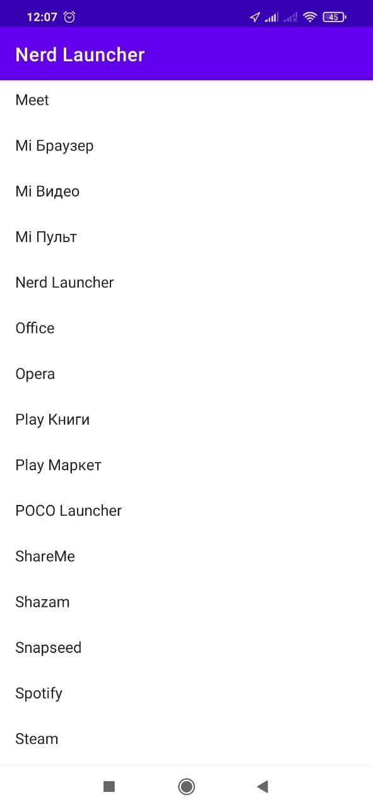

# NerdLauncher
Тестовый учебный проект, в котором реализованы некоторые возможности операционной системы андроид,
написанный в ходе чтения книги ["Android Programming: The Big Nerd Ranch Guide"](https://www.amazon.com/Android-Programming-Ranch-Guide-Guides/dp/0135245125/ref=dp_ob_title_bk).

Приложение представляет собой простой лаунчер, способный заменить стандартный лаунчер устройсва.

